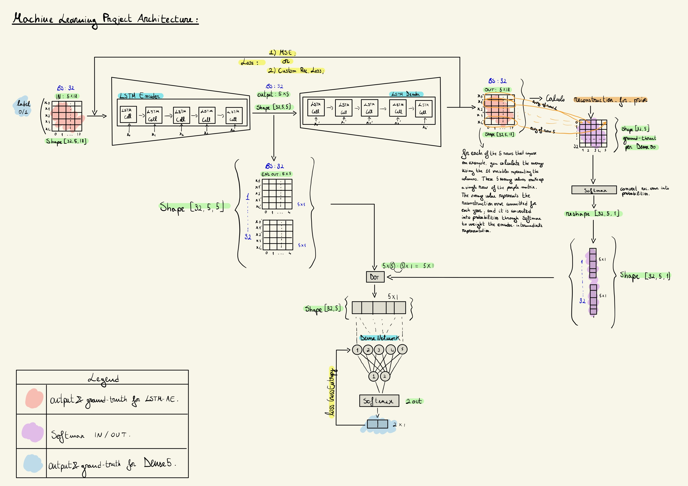

# bankruptcy-lstm-autoencoder
This is a machine learning project that employs LSTM autoencoders to reconstruct input data. The end goal is to detach the decoder after training the encoder, and attach a separate fully connected module to predict the state of a company (whether it's healthy or at risk of bankruptcy).

## Network Architecture

