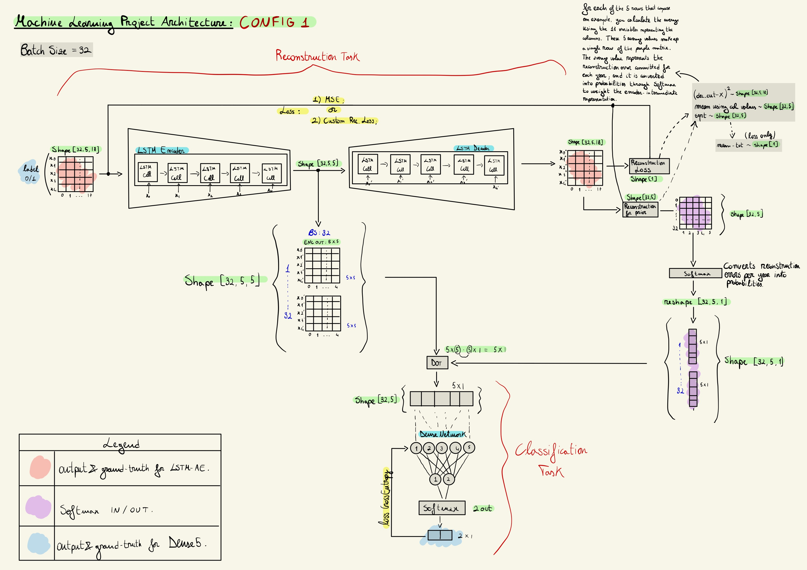
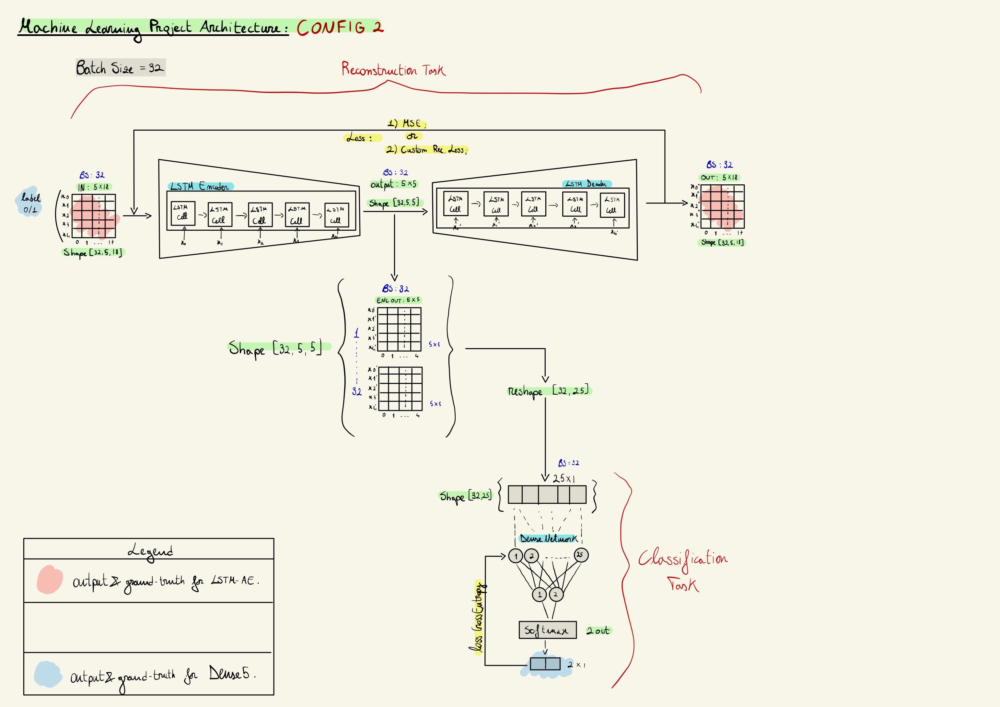
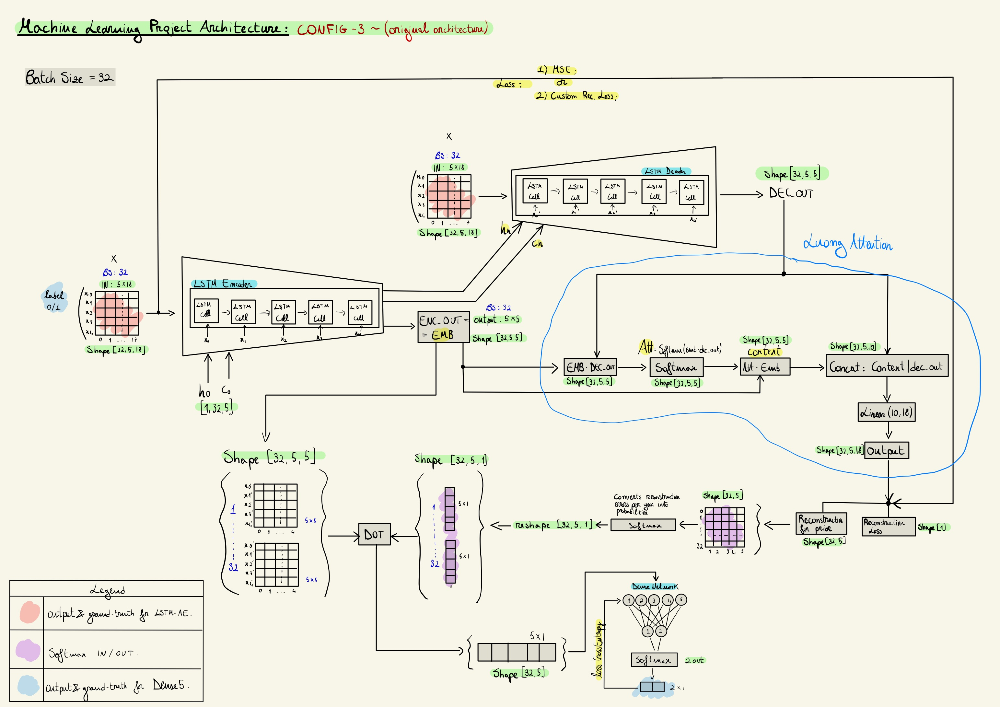

# bankruptcy-lstm-autoencoder (ENG)
Predicting corporate bankruptcy is one of the fundamental tasks in credit risk assessment. Machine learning (ML) enabled the development of several models for bankruptcy prediction. The most challenging aspect: dealing with the class imbalance due to the rarity of bankruptcy events in the real economy.

The main objective of this research is to compare the performance of three different architectures employed in predicting corporate bankruptcy, by combining a classification task with an anomaly detection task (specifically: reconstruction task with LSTM-Autoencoder).

This is a machine learning project that employs LSTM autoencoders to reconstruct input data. The end goal is to use the embedding of the encoder after training and attach a separate fully connected module to predict the state of a company (whether it's healthy or at risk of bankruptcy). The end goal can be reached using three different architectures illustrated in the schemas below.

## Network Architectures





- `custom_dataset.py`: This module is responsible for generating dataloaders for training and validation.

- `main.py`: This module is responsible for launching the simulation. It utilizes other modules, including:
  (i) Modules for handling training/validation data (dataloader generation).
  (ii) Modules for training and validation.

- `metrics.py`: This module contains various metrics and loss functions used during training and validation.

- `models.py`: This module contains implementations of network architectures presented in the above schemas.

- `plotting_utils.py`: This module contains several useful functions for plotting metrics, results, confusion matrix and more.

- `pytorchtools.py`: This module includes an early stopping mechanism implementation. 

- `reproducibility.py`: This module includes various methods used to limit the number of sources of nondeterministic behavior in PyTorch. 

- `solver.py`: This module includes various methods for training, validation, and testing the model. It also provides functionality for saving and loading the model. 

The **results** are contained within the `results/final_considerations.pdf` file.

The **dataset** is containted inside the directory `results/data.zip`.

**Other interesting resources:**

- **[Machine Learning for Bankruptcy Prediction in the American Stock Market: Dataset and Benchmarks](https://scholar.google.com/citations?view_op=view_citation&hl=it&user=XaGrJdQAAAAJ&sortby=pubdate&citation_for_view=XaGrJdQAAAAJ:qxL8FJ1GzNcC)**

## The parameters that can be provided through the command line and allow customization of the execution are:

| Argument              | Description                                                                                                                            |
|-----------------------|----------------------------------------------------------------------------------------------------------------------------------------|
| data_path             | The path where to get the raw-dataset                                                                                                  |
| seq_len               | The lenght of the time-series sequence                                                                                                 |
| num_classes           | The number of classes to predict                                                                                                       |
| train_only_ae         | This parameter is used to set the configuration which trains the LSTM-AE without the Luong Attention mechanism only on alive companies |
| train_luong_att       | This parameter is used to set the configuration which trains the LSTM-AE using the Luong Attention mechanism only on alive companies   |
| freeze_ae             | The lstm-autoencoder is not trained during the classification task                                                                     |
| config_2              | this configuration train the fc-dense5-net using directly the encoder output                                                           |
| run_name              | The name assigned to the current run                                                                                                   |
| model_name            | The name of the model to be saved or loaded                                                                                            |
| enc_input_size        | The number of expected features in the input x                                                                                         |
| enc_hidden_size       | The number of features in the hidden state h of the encoder                                                                            |
| dec_input_size        | The number of expected features in the output of the encoder                                                                           |
| dec_hidden_size       | The number of features in the hidden state h of the decoder                                                                            |
| num_layers            | The number of recurrent layers                                                                                                         |
| num_epochs            | The total number of training epochs                                                                                                    |
| batch_size            | The batch size for training, validation and test  data                                                                                 |
| workers               | The number of workers in the data loader                                                                                               |
| random_seed           | The random seed used to ensure reproducibility                                                                                         |
| lr                    | The learning rate for optimization                                                                                                     |
| loss                  | The loss function used for model optimization                                                                                          |
| opt                   | The optimizer used for training                                                                                                        |
| patience              | The threshold for early stopping during training                                                                                       |
| resume_train          | Determines whether to load the model from a checkpoint                                                                                 |
| checkpoint_path       | The path to save the trained model                                                                                                     |
| weights_init          | Determines whether to use weights initialization                                                                                       |


### Prerequisites

- [Python](https://www.python.org/downloads/) 3.5 or later installed on your system.
- The following modules:
  - [os](https://docs.python.org/3/library/os.html)
  - [torch](https://pytorch.org/)
  - [numpy](https://numpy.org/)
  - [tqdm](https://tqdm.github.io/)
  - [matplotlib](https://matplotlib.org/)
  - [torch.utils.data](https://pytorch.org/docs/stable/data.html)
  - [random](https://docs.python.org/3/library/random.html)
  - [argparse](https://docs.python.org/3/library/argparse.html)
  - [torch.utils.tensorboard](https://pytorch.org/docs/stable/tensorboard.html)
  - [pandas](https://pandas.pydata.org/)
  - [torch.optim](https://pytorch.org/docs/stable/optim.html)

Make sure to install these modules using `pip` or any other package manager like `miniconda` before running the code.

- [Python](https://www.python.org/downloads/) 3.5 or later installed on your system.
- [Miniconda](https://docs.conda.io/en/latest/miniconda.html) installed on your system (optional but recommended).

### Installation

1. Clone this repository to your local machine or download the ZIP file and extract its contents.

   ```shell
   git clone https://github.com/your-username/repository-name.git
   ```

2. Navigate to the project directory.

   ```shell
   cd repository-name
   ```

3. (Optional) Create a virtual environment using Miniconda to isolate the project dependencies. If you don't have Miniconda installed, you can skip this step and proceed with the regular package installation.

   - Create a new virtual environment.

     ```shell
     conda create -n myenv python=3.9
     ```

   - Activate the virtual environment.

     - For Windows:

       ```shell
       conda activate myenv
       ```

     - For macOS/Linux:

       ```shell
       source activate myenv
       ```

4. Install the required modules.

   ```shell
   conda install -c conda-forge matplotlib pytorch numpy tqdm torchvision opencv pillow pandas
   pip install albumentations torchmetrics
   ```

5. Download the dataset and extract it to a suitable location on your system.

### Usage

Once you have completed the installation steps and downloaded the dataset, you need to define the correct file paths in the main.py file. Open the main.py file and modify the default value of the corresponding argparse parameter or provide the correct path through the command line to the appropriate paths to the dataset on your system.

After setting the correct file paths, you can run the `main.py` file. For examples you can:

```shell
python main.py --random_seed 15 --train_only_ae --run_name train_only_ae --model_name only_ae_rs15 --num_epochs 3000 --loss rec_loss --patience 30 --weights_init
```

```shell
python main.py --random_seed 15 --run_name classif_rs15 --model_name only_ae_rs15 --num_epochs 10 --opt Adam --loss rec_loss --patience 2 --weights_init
```

```shell
python main.py --random_seed 15 --train_only_ae --train_luong_att --run_name train_only_ae_luong_att --model_name only_ae_rs15_luong_att --num_epochs 3000 --loss rec_loss --patience 30 --weights_init
```

```shell
python main.py --random_seed 15 --train_luong_att --run_name classif_rs15_luong_att --model_name only_ae_rs15_luong_att --num_epochs 10 --opt Adam --loss rec_loss --patience 2 --weights_init
```

Make sure you are in the project directory and have activated your virtual environment (if applicable) before running the above command.

### Additional Notes

- Modify the `main.py` file according to your needs or replace it with your own Python script.
- Inside results folder you can find some checkpoints of models. 
- Inside the results folder, you can find several runs that can be visualized using TensorBoard with the following command:

```shell
tensorboard --loddir=runs
```
Make sure you are in the project directory and have activated your virtual environment (if applicable) before running the above command.

Happy coding!
